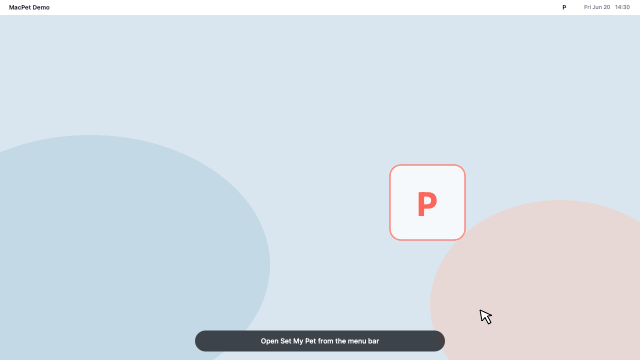

# MacPet

<p align="center">
  
</p>

MacPet is a lightweight native macOS menu bar app that displays a local image or looping GIF as a click-through desktop pet. It uses Swift and AppKit and does not use the network.

## Demo

<p align="center">
  <a href="Resources/MacPetDemo.mp4">
    
  </a>
</p>

<p align="center"><sub>Click the preview to open the MP4 video.</sub></p>

## Requirements

- macOS 14 or later
- Xcode Command Line Tools

Install the command line tools once if needed:

```bash
xcode-select --install
```

## Build and install from GitHub

```bash
cd MacPet
./scripts/build-app.sh
cp -R .build/release/MacPet.app /Applications/
open /Applications/MacPet.app
```

For a downloaded ZIP, extract it, open Terminal in the extracted `MacPet` folder, and run the last three commands starting with `./scripts/build-app.sh`.

The app is ad-hoc signed for local use. On the first launch, if macOS blocks it because it was downloaded from the internet, Control-click `MacPet.app`, choose **Open**, then confirm **Open**.

## Use

1. Click the `P` icon in the macOS menu bar.
2. Open **Set My Pet...** and choose a local PNG, JPEG, GIF, TIFF, or BMP image.
3. Set its size, opacity, display, and position.
4. Use **Adjust Image** to drag it. Outside adjustment mode, mouse clicks pass through to the app below it.

When the pet is resized, the outer corner of its current display quadrant stays fixed. For example, a pet in the bottom-left quadrant grows from its bottom-left corner, while one in the top-right quadrant grows from its top-right corner.

GIF playback uses the source frame timing by default. A custom FPS control appears only when a GIF is selected.

## Distribution note

For a public downloadable release that opens without Gatekeeper warnings, the app must be signed with an Apple Developer ID certificate and notarized by Apple. Until that release pipeline is configured, users can build the app locally with the steps above.
